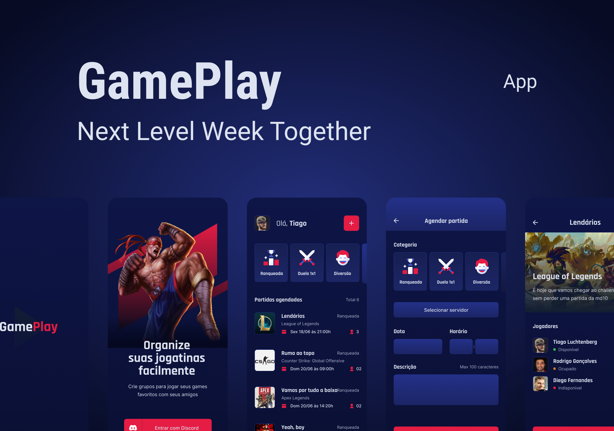

<div align="center" >
  
</div>
<br>

<p align="center">
  
</p><br><br><br>


# NLW#06 ReactNative - GamePlay


## Features 

-   [x] Autenticação Social OAuth2 com servidor do Discord.
-   [x] Obtém perfil do usuário cadastro no Discord (username e avatar);
-   [x] Lista os servidores do Discord que o usuário faz parte;
-   [x] Permite realizar o agendamento de partidas;
-   [x] Permite filtrar as partidas por categoria;
-   [x] Exibe se a partida foi agendada em um servidor próprio (anfitrião) ou em servidores de outros (convidado);
-   [x] Compartilha o convite para ingressar no servidor do usuário;
-   [x] Permite redirecionar o usuário para o seu próprio servidor;
-   [x] Disponibiliza a função de Logout.

## Tecnologias

-   [x] React Native
-   [x] Typescript
-   [x] Expo
-   [x] Context API
-   [x] Async Storage
-   [x] Vector Icons
-   [x] React Native Svg e Svg Transform
-   [x] Axios
-   [x] Gradient colors
-   [x] OAuth2 Discord 
-   [x] Expo Google Fonts
-   [x] React Navigation Stack
-   [x] Expo Authentication
-   [x] React Native Share
-   [x] Deep Link

## Instalação
Faça o clone do repositório

Instalando as dependências
```bash
npm i
```

Inicie o projeto
```bash
npx expo start
```

Variáveis de ambiente:
```bash
REDIRECT_URI=
SCOPE=
RESPONSE_TYPE=
CLIENT_ID=
CDN_IMAGE=
```
Para ter acesso a estes dados é necessário criar uma aplicação no servidor do discord. (Lembre-se de renomear .env.example para .env)